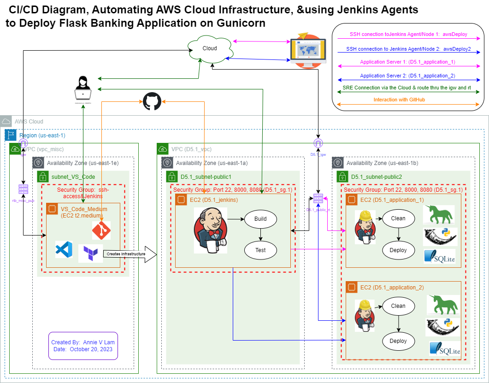
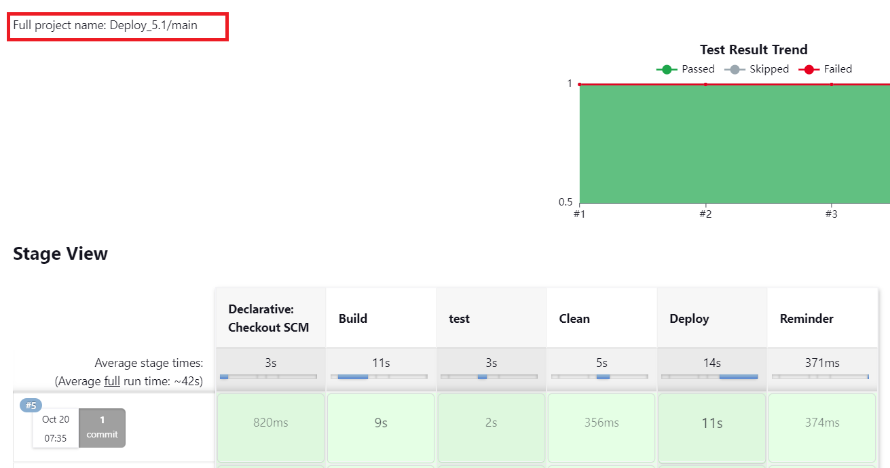

# Deploy a Banking Application using Jenkins Agents and Gunicorn

October 20, 2023

By:  Annie V Lam - Kura Labs

# Purpose

SSH from Jenkins Server to Jenkins Agent Servers to deploy banking application on Gunicorn.

Previously, in the Jenkins Deploy stage, it SSHed to a second server to deploy the banking application on Gunicorn.  For this deployment, we are configuring Jenkins Agent to SSH from Jenkins Server to Agent Servers to deploy the application.

## Step #1 Diagram the VPC Infrastructure and the CI/CD Pipeline




## Step #2 GitHub/Git

**GitHub Repository and Jenkins Integration:**

GitHub serves as the repository from which Jenkins retrieves files to build, test, and deploy the URL Shortener application.

**Changes in the repository for Jenkins Build Deploy_5v1**

In this deployment, the Jenkinsfile is already killing Guniocorn and deploying the application from the server D5.1_jenkins_agent in the "Clean" and "Deploy" stages, respectively.  We will use git to make changes in the [Jenkinsfile]() to include killing Gunicorn and deploying the application from the server D5.1_jenkins_agent server_2.

**GIT Commands**

```
git clone https://github.com/kura-labs-org/c4_deployment-5.1.git
cd c4_deployment-5.1/
git init
git remote set-url origin https://github.com/LamAnnieV/deploy_5.1.git
git fetch
git push --mirror
git branch second
git switch second
#make edits to the Jenkinsfile
git commit -a
git push --set-upstream origin second
#Run Jenkins build
git switch main
git merge second
git push
```

In order for the EC2 instance, where Jenkins is installed, to access the repository, you need to generate a token from GitHub and then provide it to the EC2 instance.

[Generate GitHub Token](https://github.com/LamAnnieV/GitHub/blob/main/Generate_GitHub_Token.md)


## Step #3 Automate the Building of the Application Infrastructure 

Create a [Key Pair](https://github.com/LamAnnieV/Create_EC2_Instance/blob/main/Create_Key_Pair.md) first.

For this application infrastructure, we want:  

```
1 VPC
2 Availability Zones
2 Public Subnets
3 EC2 Instances
1 Route Table
1 Security Group with ports 22, 8000, 8080

```
To automate the construction of the application infrastructure, employ an instance equipped with VS Code and Terraform. The [main.tf](Images/main.tf) and [variables.tf](Images/variables.tf) files, define the resources to be created and declare variables. Additionally, Terraform enables the execution of installation scripts. In the case of one instance, an installation script was utilized for [installing Jenkins](https://github.com/LamAnnieV/Instance_Installs/blob/main/01_jenkins_installs.sh).

**Jenkins**

Jenkins is used to automate the Build, Test, and Deploy the Banking Application.  To use Jenkins in a new EC2, all the proper installs to use Jenkins and to read the programming language that the application is written in need to be installed. In this case, they are Jenkins, Java, and Jenkins additional plugin "Pipeline Keep Running Step", which is manually installed through the UI interface.


## Step #4 Other Installation

For the Jenkins Server install the following:

```
sudo apt install software-properties-common -y
sudo add-apt-repository -y ppa:deadsnakes/ppa
sudo apt install python3.7 -y
sudo apt install python3.7-venv -y
sudo apt update
```

For the two Jenkins Agent (Application) Servers, install the following:

```
sudo apt install default-jre -y
sudo apt install software-properties-common -y
sudo add-apt-repository -y ppa:deadsnakes/ppa
sudo apt install python3.7 -y
sudo apt install python3.7-venv -y
```


## Step #5 Configure Jenkins Build and Run Build

**"Deploy_5.1" Build**

[Create Jenkins Multibranch Pipeline Build](https://github.com/LamAnnieV/Jenkins/blob/main/Jenkins_Multibranch_Pipeline_Build.md)

Jenkins Build:  In Jenkins create a build "Deploy_5.1" to run the file Jenkinsfile for the Banking application from [GitHub Repository](https://github.com/LamAnnieV/deploy_5.1.git) and run the build.  This build consists of: The Build, the Test, the Clean, and the Deploy stages.


**Result**

Jenkins build "Deploy_5.1" was successful for both Jenkins Agents.


D5.1_jenkins_agent (awsDeploy)




D5.1_jenkins_agent (awsDeploy2)


## Issue(s)

Mainly user error, when configuring the Jenkins Agent in Jenkins the private key is from the .PEM file that was generated from creating a new key pair.

## Conclusion

Using Jenkins Agent is very successful, however, it is still not very secure.  To make it more secure the Application Layer and Data Layer need to be on their own tier separate from the Web Layer.
  
## Area(s) for Optimization:

-  Enhance automation of the AWS Cloud Infrastructure by implementing Terraform modules.
-  Enhance Security by putting the Application Layer and Data Layer on a private server but the Web Server will remain on the public server.

Note:  ChatGPT was used to enhance the quality and clarity of this documentation
  
